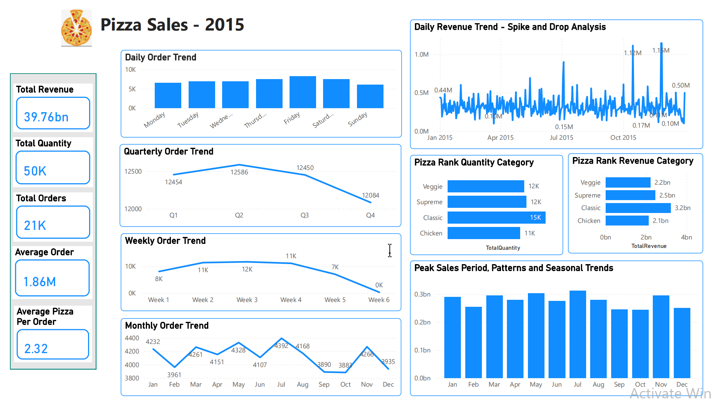
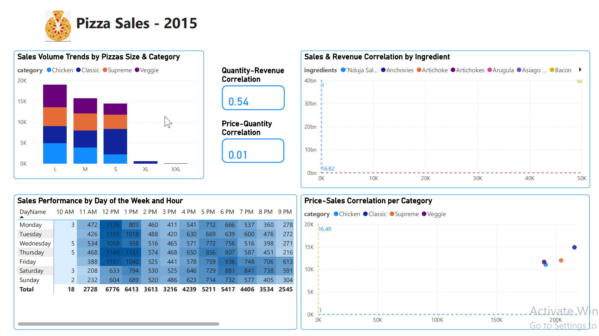
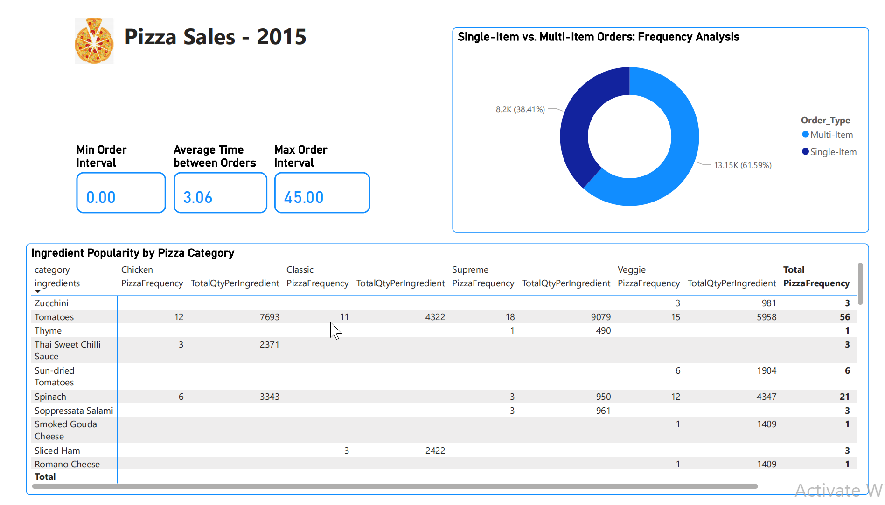

# 🍕 Business Insights & Recommendations – Pizza Sales 2015

## 📊 Overview

This project provides detailed insights into pizza sales throughout **2015**. It analyzes quarterly, monthly, daily, and hourly trends, as well as performance by **pizza category, size, and ingredients**. Top and bottom-performing pizzas are also identified by **revenue, quantity**, and **number of orders**.

These insights aim to help the company understand customer behavior and make informed, data-driven decisions to **expand operations** and **increase profitability**.

The dataset includes order details from 2015, capturing the exact **date and time** of each order and the **quantity** of each pizza type and size sold.

---

## 🎯 Project Goals

- Calculate total Revenue, Total Quantity Sold, Total Orders, Average 
  Order Value, Average Pizzas per Order.
- Analyze daily, weekly, quarterly and monthly order trends.
- Investigate spikes or drops in sales and identify potential causes.
- Identify peak sales periods, patterns and seasonal trends.
- Rank pizza categories by total quantity sold and revenue.
- Identify top 5 and bottom 5 pizzas by quantity and revenue.
- Analyze the relationship between pizza size,category and sales volume
- Analyze sales performance by day of the week and hour.
- Explore the correlation between sale correlation by ingredient.
- Explore the correlation between price and sales by category.
- Examine price vs. quantity correlations, revenue vs. quantity correlations.
- Analyze the ratio of single-item vs. multi-item orders
- Calculate average, maximum, and minimum time intervals between orders
- Analyze the ingredient popularity by pizza category.
---

## 🧮 Data Transformation

The raw data was cleaned and organized into **6 relational tables** for efficient analysis:
| Table Name     | Description |
|----------------|-------------|
| `Pizza`     | Contains pizza ID, category ID, name |
| `PizzaType`    | Contains category ID and name|
| `Ingredients`        | Contains ingredients  |
| `Ingredients Pizza`        | Contains pizza ID and ingredients  |
| `Order`        | Contains order ID, date and time|
| `OrderDetails` | Contains order ID, pizza ID, and size |

## 🧮 Data Modelling

---

## 📈 Dashboard Insights (Power BI)
**1. Sales Trend and Product Dashboard**

The total revenue increased from quarter 1 to quarter 2 with the top peak at $208K and decreased significantly in quarter 4. February, September, October, and December had the lowest revenue compared to other months. Revenue remained stable in weeks 2, 3, and 4, but showed a decline in week 1. Due to the calendar's limited data for weeks 5 and 6, revenue in these weeks is much lower than in other weeks. Friday had the highest revenue at $136.07K, followed by Thursday and Saturday. Sunday had the lowest revenue at $99.20K.
The Classic category is the most popular in terms of orders and generates the highest revenue.
The Thai Chicken pizza contributed the most to the increase in total revenue. Additionally, the Classic Deluxe was the best seller and the most frequently ordered. In contrast, the Brie Carre was the least ordered and sold pizza.

**2. Order Correlation Dashboard**

Total orders increased from quarter 1 to quarter 3, with a dramatic decrease in quarter 4. Orders peaked in July with 1,935. Similar to revenue, the number of orders remained stable in weeks 2, 3, and 4, but showed a decline in week 1. Customers placed the most orders on Fridays.
The highest number of orders occurred between 12 PM and 1 PM from Monday to Friday, and between 5 PM and 6 PM from Monday to Sunday.

**3. Size Ingredient and Order Frequency Timing Dashboard**

- **Multi-item orders** accounted for **61.59%** of total orders  
  → Multi-item: 13.15K, Single-item: 8.2K  
  
- **Most popular sizes**: L and XL pizzas  
  → The large size of pizza was the most preferred by customers.
    The common price as $20.75 contributed the most in total revenue and total sales.

- **Top Ingredients** (by frequency & quantity):
  - **Tomatoes**: 7,693 (Classic), 4,322 (Supreme), 907 (Veggie)
  - **Red Peppers**: 8,680 (Chicken), 3,891 (Supreme)
  - **Chicken**: 8,618 (Chicken category)

---

## ✅ Business Recommendations

1. **Focus Marketing on Classic Pizzas**  
   → Promote best-performing category to boost already strong sales

2. **Launch Campaigns in July, November, and January**  
   → Maximize revenue during known peak months with targeted promotions

3. **Encourage Upgrades from Single-Item Orders**  
   → 38.41% of orders are single-item  
   → Offer combo deals or limited-time upsell campaigns

4. **Review Bottom 5 Low-Performing Pizzas**  
   → Consider removing or improving based on sales data

5. **Investigate Anomalies in Order Timing**  
   → Example: -53 minutes between some orders → possible data error

6. **Add Weekday & Time-of-Day Analysis**  
   → Helps optimize staffing and campaign scheduling

