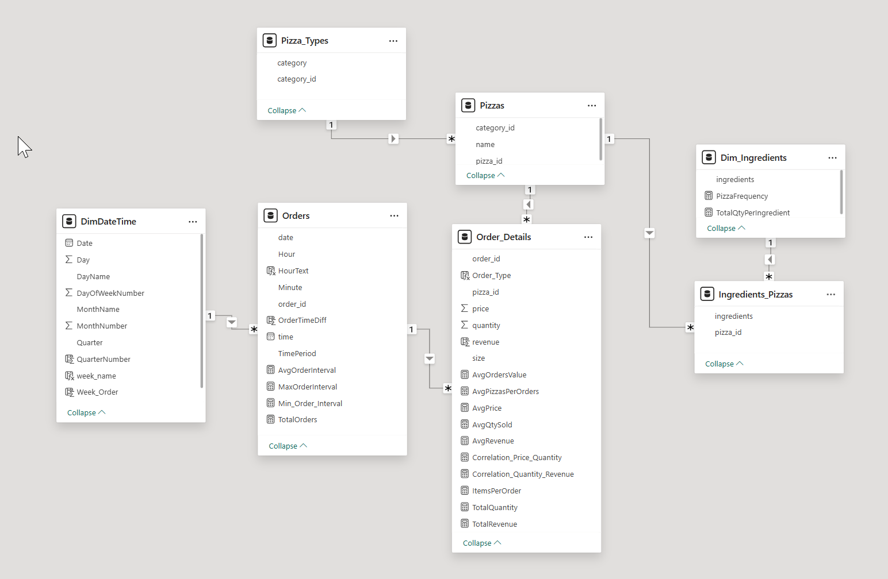
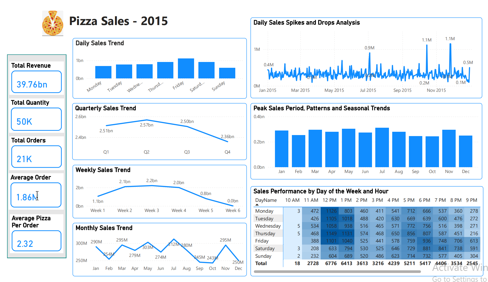
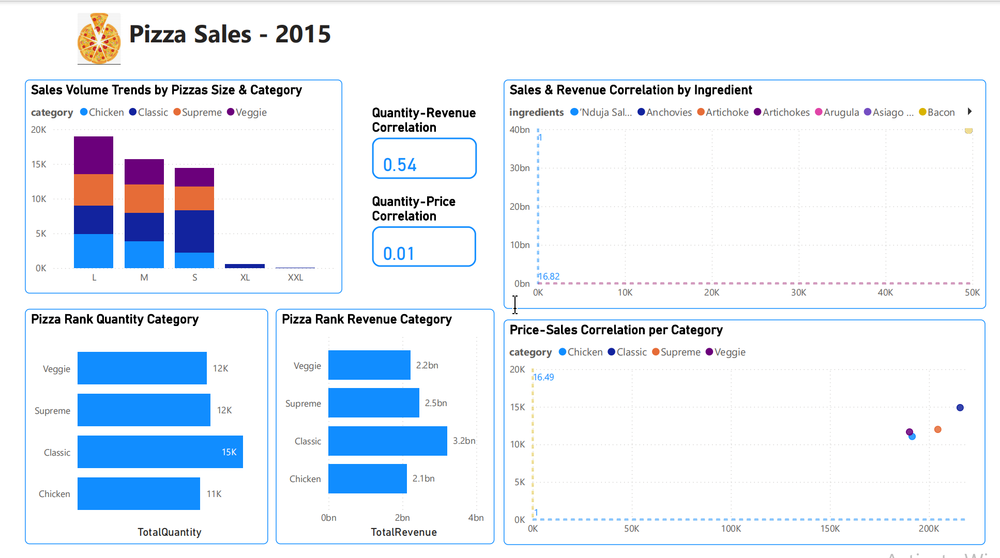
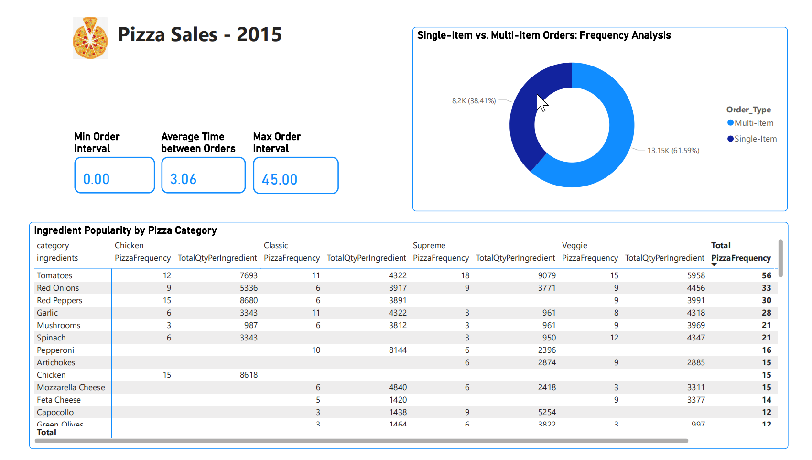

# 🍕 Business Insights & Recommendations – Pizza Sales 2015

## 📊 Overview

This project provides detailed insights into pizza sales throughout **2015**. It analyzes **quarterly, monthly, daily, and hourly trends**, as well as performance by **pizza category, size, and ingredients**. Top and bottom-performing pizzas are also identified by **revenue, quantity**, and **number of orders**.

These insights aim to help the company understand customer behavior and make informed, data-driven decisions to **expand operations** and **increase profitability**.

The dataset includes order details from 2015, capturing the exact **date and time** of each order and the **quantity** of each pizza type and size sold.

---

## 🎯 Project Goals

- Calculate **Total Revenue**, **Total Quantity Sold**, **Total Orders**, **Average Order Value**, **Average Pizzas per Order**
- Analyze **daily, weekly, quarterly**, and **monthly** sales trends
- Investigate **daily spikes and drops** in sales and identify potential causes
- Identify **peak sales periods**, patterns, and **seasonal trends**
- Analyze sales performance by **day of the week** and **hour**
- Analyze sales **volume trends** by pizza size and category
- Rank pizza categories by **total quantity sold** and **revenue**
- Identify **Top 5** and **Bottom 5** pizzas by quantity and revenue
- Explore the **correlation between sales and ingredients**
- Explore the **correlation between price and sales** by category
- Examine **price vs. quantity** and **revenue vs. quantity** correlations
- Analyze the ratio of **single-item vs. multi-item orders**
- Calculate **average, maximum, and minimum** time intervals between orders
- Analyze **ingredient popularity** by pizza category

---

## 🧮 Data Transformation

The raw data was cleaned and organized into **6 relational tables** for efficient analysis:

| Table Name          | Description                                     |
|---------------------|-------------------------------------------------|
| `Pizza`             | Contains pizza ID, category ID, and name        |
| `PizzaType`         | Contains category ID and category name          |
| `Ingredients`       | Contains list of ingredients                    |
| `Ingredients_Pizza` | Maps pizza ID to ingredients                    |
| `Order`             | Contains order ID, date, and time               |
| `OrderDetails`      | Contains order ID, pizza ID, size, price, quantity |

---

## 🧮 Data Modelling

---

## 📈 Dashboard Insights (Power BI)

**1. KPI and Sales Dashboard**  
- Total sales increased from Quarter 1 to Quarter 2, peaking at **$2.57 billion**, and then decreased significantly in Quarter 4  
- **February, September, October, and December** had the lowest sales compared to other months  
- Sales remained stable in Weeks **2, 3, and 4**, but declined in Weeks **1, 5, and 6**  
- **Friday** had the highest revenue at **$1.102 billion**, followed by **Thursday** and **Saturday**  
- **Sunday** had the lowest revenue at **$568.992 million**  
- Peak order times were:  
  → **12 PM – 1 PM** (Monday to Friday)  
  → **5 PM – 6 PM** (Monday to Sunday)

**2. Product Dashboard**  
- **Large size** pizzas were the most preferred by customers  
- In contrast, **XXL size** pizzas were the least preferred  
- The **Classic** category ranked highest in both quantity (**~15k units**) and revenue (**~$3.2 billion**)

**3. Order and Ingredient Dashboard**  
- **Multi-item orders** accounted for **61.59%** (**13.15k orders**)  
- **Single-item orders** accounted for **38.41%** (**8.2k orders**)  
- **Top 3 ingredients** by frequency and quantity were:

  - **Tomato**: 7,693 (Classic), 4,322 (Supreme), 907 (Veggie)  
  - **Red Peppers**: 8,680 (Chicken), 3,891 (Supreme)  
  - **Chicken**: 8,618 (Chicken category)

---

## ✅ Business Recommendations

1. **Focus Marketing on Classic Pizzas**  
   → Promote the best-performing category to boost already strong sales

2. **Launch Campaigns in July, November, and January**  
   → Maximize revenue during known peak months with targeted promotions

3. **Encourage Upgrades from Single-Item Orders**  
   → 38.41% of orders are single-item  
   → Offer **combo deals** or **limited-time upsell campaigns**

4. **Review Bottom 5 Low-Performing Pizzas**  
   → Consider **removing** or **reformulating** based on poor performance

5. **Add Weekday & Time-of-Day Analysis**  
   → Helps optimize **staffing**, **inventory**, and **campaign scheduling**

6. **Create Ingredient-Based Promotions**  
   → Highlight popular ingredients (e.g., **Tomato, Red Peppers, Chicken**) in special pizza variants or bundles
