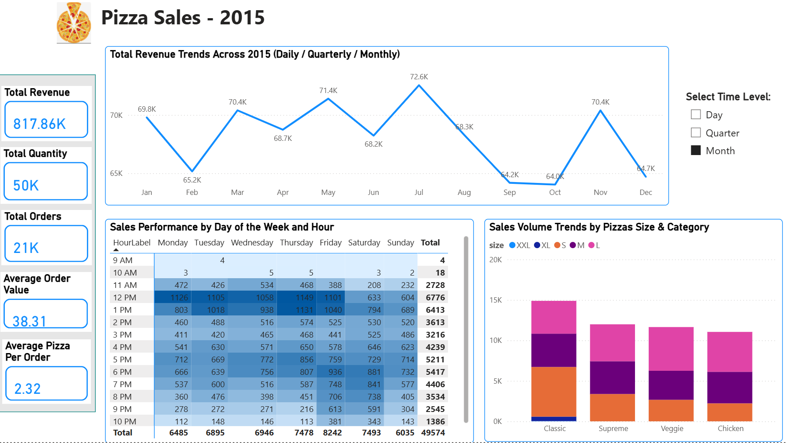

# 🍕 Business Insights & Recommendations – Pizza Sales 2015

## 📊 Overview

This project provides detailed insights into pizza sales throughout **2015**. It analyzes **quarterly, monthly, daily, and hourly trends**, as well as performance by **pizza category, size, and ingredients**. Top and bottom-performing pizzas are also identified by **revenue, quantity**, and **number of orders**.

These insights aim to help the company understand customer behavior and make informed, data-driven decisions to **expand operations** and **increase profitability**.

The dataset includes order details from 2015, capturing the exact **date and time** of each order and the **quantity** of each pizza type and size sold.

---

## 🎯 Project Goals

- Calculate **Total Revenue**, **Total Quantity Sold**, **Total Orders**, **Average Order Value**, **Average Pizzas per Order**
- Analyze **daily, weekly, quarterly**, and **monthly** sales trends
- Investigate **daily spikes and drops** in sales and identify potential causes
- Identify **peak sales periods**, patterns, and **seasonal trends**
- Analyze sales performance by **day of the week** and **hour**
- Analyze sales **volume trends** by pizza size and category
- Rank pizza categories by **total quantity sold** and **revenue**
- Identify **Top 5** and **Bottom 5** pizzas by quantity and revenue
- Explore the **correlation between sales and ingredients**
- Explore the **correlation between price and sales** by category
- Examine **price vs. quantity** and **revenue vs. quantity** correlations
- Analyze the ratio of **single-item vs. multi-item orders**
- Calculate **average, maximum, and minimum** time intervals between orders
- Analyze **ingredient popularity** by pizza category

---

## 🧮 Data Transformation

The raw data was cleaned and organized into **6 relational tables** for efficient analysis:

| Table Name          | Description                                     |
|---------------------|-------------------------------------------------|
| `Pizzas`             | Contains pizza ID, category ID, and name        |
| `Pizza_Types`         | Contains category ID and category name          |
| `Dim_Ingredients`       | Contains list of ingredients                    |
| `Ingredients_Pizzas` | Maps pizza ID to ingredients                    |
| `Orders`             | Contains order ID, date, and time               |
| `Order_Details`      | Contains order ID, pizza ID, size, price, quantity |

---

## 🧮 Data Modelling

---

## 📈 Dashboard Insights (Power BI)

**1. KPI and Sales Dashboard**  
- Total sales increased from Quarter 1 to Quarter 2, peaking at **$208K**, and then decreased significantly in Quarter 4.
→ Likely due to higher demand during summer and school holidays in Q2, while in Q4 customers shifted their spending to gifts and holiday-related dining.
- Peak Seasons: Sales reached the highest in July (school holidays). **February, September, October, and December** had the lowest sales compared to other months due to typical off-season periods.
→ July benefited from family gatherings and vacations, while the off-season months recorded less social dining activity.
- Sales remained stable in Weeks **2, 3, and 4**, but declined in Weeks **1, 5, and 6**.
→ Early weeks after holidays and month-end weeks often see reduced demand as customers adjust spending.
- Sales often spike on weekends. **Friday** had the highest revenue at **$136.073K**, followed by **Thursday** and **Saturday** due to higher customer demand.
→ Customer behavior shows higher spending toward the weekend, with Thursday promotions and social events also driving sales.
- **Sunday** had the lowest revenue at **$99.203K**.
→ Families typically stay at home and spend less on outside food.
- Peak order times were:
→ 12 PM – 1 PM (Monday to Friday)
→ 5 PM – 6 PM (Monday to Sunday)
→ These are standard lunch and dinner periods when both office workers and families tend to order more.

  

**2. Product Dashboard**  
- Overall, **Large size** pizzas were the most preferred by customers. In contrast, **XXL size** pizzas were the least preferred for all categories.  
- The **Classic** category ranked highest in both quantity (**~15k units**) and revenue (**~$0.22 million**)
- Quantity–Revenue Correlation: 0.54.There is a moderate positive relationship, meaning higher sales quantity tends to increase revenue.
- Quantity–Price Correlation: -0.95. There is a strong negative relationship, meaning higher prices are associated with lower sales quantities.

- The Thai Chicken pizza contributed the most to the increase in total revenue (43K). Additionally, the Classic Deluxe was the best seller and the most frequently ordered (quantity: 2.5K). In contrast, the Brie Carre was the least ordered and sold pizza (revenue: 11.6K,quantity: 490).

**3. Order and Ingredient Dashboard**  
- **Multi-item orders** accounted for **61.59%** (**13.15k orders**)  
- **Single-item orders** accounted for **38.41%** (**8.2k orders**)  
- **Top 3 ingredients** by frequency and quantity were:

  - **Garlic**: Total pizza Frequency (57), Total Quantity Per Ingredients (27913).
  - **Tomatoes**: Total pizza Frequency (56), Total Quantity Per Ingredients (27052).
  - **Red Onions**: Total pizza Frequency (41), Total Quantity Per Ingredients (19834).

---

## ✅ Business Recommendations

1. **Focus Marketing on Classic Pizzas**  
   - The Classic category is the best-performing, with ~15k units sold and ~$0.22M revenue. Promote these pizzas through advertising, bundles, and menu highlights to drive higher sales.

2. **Encourage Upgrades from Single-Item Orders**  
   - 38.41% of orders are single-item. Implement combo deals, upsell campaigns, or limited-time offers to increase average order value.

3. **Weekend & Peak Time Promotions**  
   - Sales peak on Thursday–Saturday, with high order volume at 12–1 PM and 5–6 PM. Run flash deals, family combos, or time-limited offers during these periods to maximize revenue.
